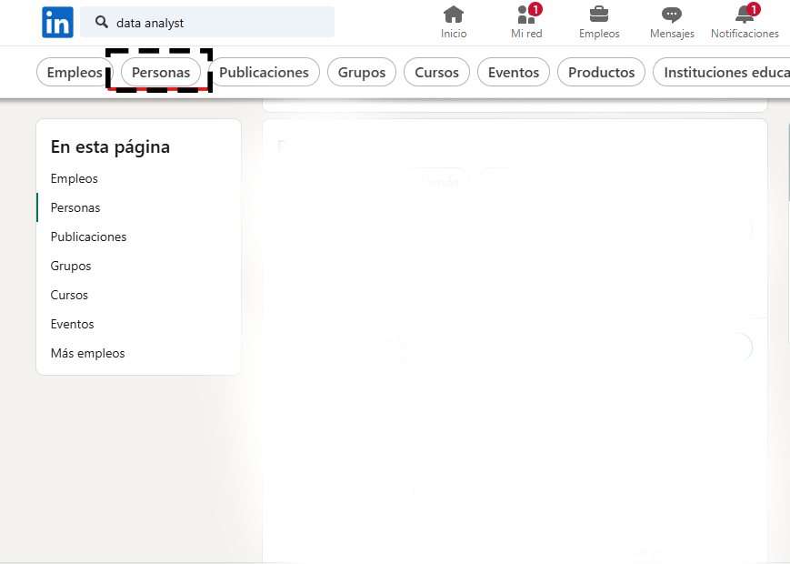

# LinkedIn-Bot 1.0

¡Bienvenido a LinkedIn-Bot 1.0! Esta aplicación te ayudará a automatizar tareas en LinkedIn, como enviar solicitudes de conexión y recomendar publicaciones y comentarios en el feed.

Puedes ver una demo de la aplicación en el siguiente enlace: 

[Demo App](https://autolinkedin.streamlit.app/)


## Funcionalidades

### Auto Networking
La función de auto networking permite enviar solicitudes de conexión automáticamente a personas en LinkedIn. El bot envía aleatoriamente entre 25 y 50 solicitudes de conexión, y en cada acción automática que realiza, espera de manera aleatoria entre 3 y 9 segundos para evitar ser detectado como bot por LinkedIn.

#### Requisitos
1. Tener Google Chrome instalado y configurado en idioma español.
2. Para obtener la URL correcta, ve a la barra de búsqueda de LinkedIn, busca el tipo de personas que deseas agregar (por ejemplo, "analista de datos"), selecciona "Personas" en el filtro de la sección superior, y finalmente copia y pega la URL resultante.

#### Ejemplo


### Auto Recomendaciones
La función de auto recomendaciones permite realizar recomendaciones automáticas (equivalente a un "Like") a publicaciones y comentarios en el feed de LinkedIn. El bot solo solicita las credenciales de acceso y comienza a operar automáticamente.


## Colaboraciones y Mejoras
El proyecto está abierto a colaboraciones y mejoras. Las próximas mejoras que planeamos incluirán la posibilidad de guardar en el propio navegador la actividad del bot y visualizarla a través de un dashboard.

## Descarga y Ejecución
Si deseas descargar y ejecutar el código fuente de la app en tu propia máquina, puedes hacerlo de la siguiente manera. Ejecuta los siguientes comandos en tu consola de IDE

1. Clona el repositorio:
    ```bash
    git clone URL_DEL_REPOSITORIO
    ```
2. Instala las dependencias:
    ```bash
    pip install -r requirements.txt
    ```
3. Ejecuta la aplicación:
    ```bash
    streamlit run app.py
    ```

## Contribución
Si deseas contribuir al proyecto, por favor, abre un issue o envía un pull request con tus propuestas de mejora. Agradecemos tus sugerencias y aportes para mejorar LinkedIn-Bot 1.0.

## Licencia
Este proyecto está bajo la Licencia MIT. Consulta el archivo `LICENSE` para obtener más información.
